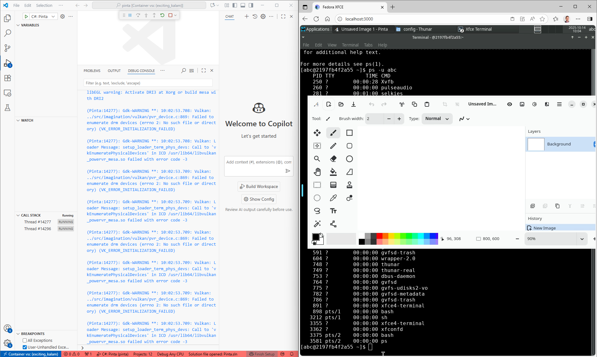
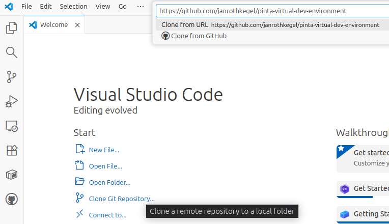
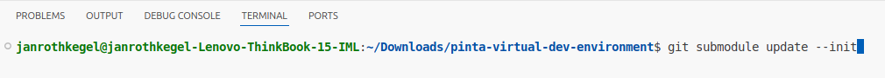
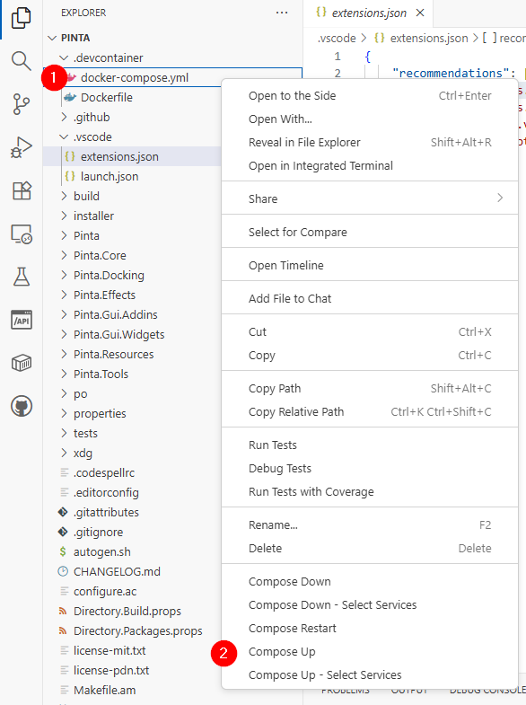
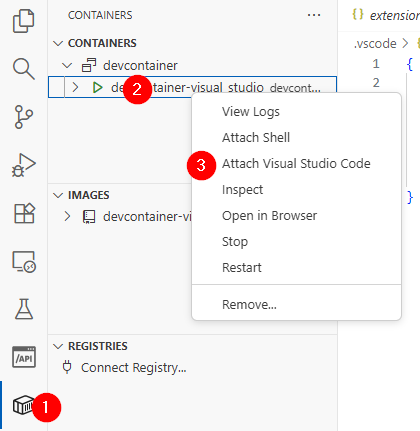
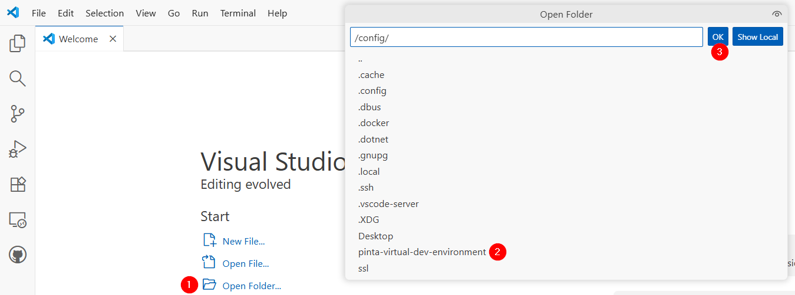
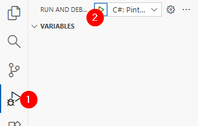
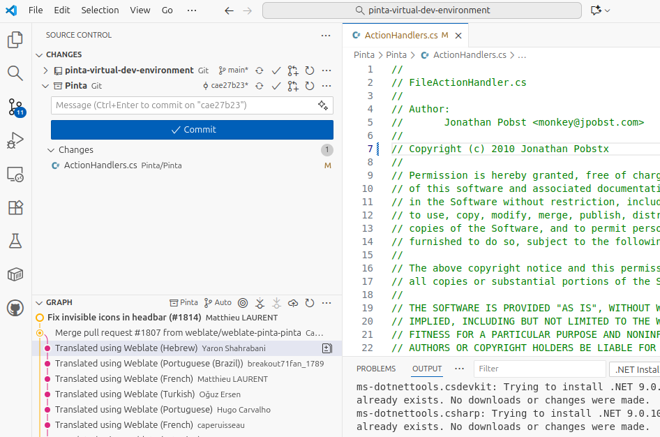

# pinta-virtual-dev-environment
A development wrapper for the pinta repository, which allows you to develop in your native OS but build and debug in a constant Fedora Desktop.

<h1>Motivation and Idea</h1>

I have been a Paint.NET user for many years. With my transition to Linux-based environments I found Pinta to be the only alternative with a really great active community. However, there is still some way to go for Pinta and so I decided to contribute - but deciding and being able to are two different stories..

It soon became evident that I was not able to debug on my Ubuntu 24.04 system because of library mismatches. The community advised me to go to some system like Fedora for a half year or so until the Ubuntu repositories are updated. But would I transit to Fedora just for Pinta? Alternatively, would it still be fun to develop in a slow VM? I guess: No!

There are probably a couple developers outside who face the same issue. And here is an approach to solve it: Let's make use of Visual Studio Code's container capabilities and let Pinta run in containerized desktop while the Visual Studio Code GUI is running in our host system!

<h1>Pre-requisites</h1>

You need

* [Visual Studio Code](https://code.visualstudio.com/download) for your OS
* Docker (e.g. [Docker Desktop](https://www.docker.com/products/docker-desktop/), [Rancher Desktop](https://rancherdesktop.io/) or the pure Docker Engine)
* [Git](https://git-scm.com/install/)

<h1>Instructions</h1>

Below you find the instructions in multiple steps. Please note that the first steps need to be run only once in order to set up the environment. Later you can directly head into step 3.

Step 1: Clone this repository (~ 1min)

 
We will now create the skeleton of our environment. You can just use Visual Studio Code to do so. 

Enter `https://github.com/janrothkegel/pinta-virtual-dev-environment.git`

Immediately after cloning the repository, Visual Studio Code might ask you whether you want to install recommended extensions - just do so (it will save you time later).

*Note: The Pinta sub-directory will be empty at this stage.*

Step 2: Inject the Pinta code (~ 2min)

 
You might have recognized that the Pinta sub-directory does not have any code in it. We are going to change this now.

 

*Optional: If you want to contribute to the project you will want to work with your fork. Please replace the default repository URL in .gitmodules with the URL of your fork.*

In order to download the referenced Pinta code, go to the Terminal in Visual Studio Code and type `git submodule update --init`

Step 3: Launch and attach to development container (~ 2min + install waiting time at first run)

 
When following the entire guide, the pinta-virtual-dev-environment folder should already be opened in Visual Studio Code. If you 

 
Please make sure that the extensions for C#, C# DevKit, Container Tools, Dev Containers are installed.

 
Now, (1) find and right-click docker-compose.yml and then (2) "Compose up" (this will take incredibly long when doing it for the first time).

 

Ok, we have our development container running in the background. Let's attach to it!
 
(1) click the "Containers" extension, (2) right-click the dev container and (3) attach to it. The server will then install in the container.

This will open another instance of Visual Studio Code - the one in which you will will build and debug Pinta in the next step.

Step 4: Build & Debug Pinta (~ 2min + waiting times)

 

In the new window open the folder `/config/pinta-virtual-dev-environment/`

Visual Studio Code will hopefully again ask you to install some extensions. If not so: Install C# and C# DevKit manually.

Wait for all the status indicators to finish working. Then go to (1) "Run and Debug" and (2) hit the play button.

**Finally, see the application popping up in http://localhost:3000/ or (if your browser restricts HTTP) https://localhost:3001/**

*Note: If you encounter messages like the one below then retry the latest step.*

Step 5: Synchronize with repository (~ 1min)

 
You also, of course, want commit your changes to your fork and then maybe send a pull request. In order to synchronize with GitHub repositories I strongly suggest to install the "GitHub Pull Requests" extension (already in your host OS instance) as it will guide you through the login process.

 
In the source control section in Visual Studio Code you will then be able to commit all the changes you made to Pinta - just make sure to select Pinta instead of pinta-virtual-dev-environment.

 

<h1>Thanks</h1>

The [webtop](https://docs.linuxserver.io/images/docker-webtop/) project forms the basis of this work. Therefore: Special thanks to them!